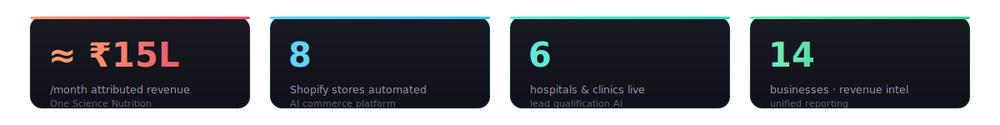

<!--
  Anuj Jain · GitHub profile README
  The three SVGs in /assets are hand-built and animated (SMIL).
  IMPORTANT: keep them referenced as . GitHub strips animation
  from SVG pasted inline as markup — as  they animate fine.
-->

<!--

  
  
  
  &nbsp;
  

-->

### I build production AI systems that move revenue - not prototypes.

I'm an **AI Solutions Engineer**. I design and ship customer-facing AI across **eCommerce, healthcare, and enterprise automation** — combining LLMs, AI agents, voice, backend engineering, and workflow orchestration into systems businesses actually run on.

The way I think about architecture looks a lot like an **n8n canvas**: real-world signals flow in, an AI agent layer reasons over them, and measurable outcomes flow out. So here's my work, drawn the way it actually works 👇

---

## ⚙️ How my systems work

<i>Sources → AI agent layer → outcomes. One architecture, deployed across dozens of businesses.</i>

---

## 📈 Impact

- 💸 AI WhatsApp commerce platform contributing **≈ ₹15L/month** in attributed revenue for **One Science Nutrition**
- 🏪 AI commerce automation live across **8 Shopify stores**
- 🏥 AI lead qualification running across **6 hospitals & clinics**
- 📊 Enterprise revenue intelligence unifying Google Ads, Meta Ads, Shopify, CRM & WhatsApp for **14 businesses**

---

## 🚀 Featured enterprise systems

<table>
<tr>
<td width="33%" valign="top">

### 📊 Revenue Intelligence Platform
*Unified attribution for 14 businesses.*

Centralizes Google Ads, Meta Ads, Shopify, CRM & WhatsApp into one revenue picture.

- Multi-platform revenue reporting
- Automated KPI dashboards
- AI-generated business insights
- Attribution built for subscription models

</td>
<td width="33%" valign="top">

### 🎙️ AI Lead Qualification
*Live in 6 healthcare orgs.*

Meta Lead Forms → Voice AI → agents → WhatsApp → CRM, end to end.

- Automated lead qualification
- ElevenLabs voice onboarding
- Appointment scheduling
- Real-time sales notifications

</td>
<td width="33%" valign="top">

### 🛒 AI Commerce Automation
*Running across 8 Shopify stores.*

AI agents + WhatsApp automation driving personalized customer journeys.

- Abandoned cart recovery
- Repeat-purchase automation
- Full lifecycle automation
- Revenue attribution

</td>
</tr>
</table>

---

## 🧰 Tech I build with

**Languages** — Python · JavaScript · TypeScript · SQL  
**AI & Agents** — OpenAI · Anthropic · Gemini · Claude Code & CLI · LangChain · LangGraph · RAG · MCP · ElevenLabs Voice AI   
**Backend & APIs** — FastAPI · Django · REST · Webhooks · OAuth/JWT · Swagger/OpenAPI   
**Automation & Integrations** — n8n · Zapier · Shopify · Interakt (WhatsApp Business API) · GoHighLevel · Meta Ads · Google Ads · Mailchimp · Payment Gateways   
**Infra & DevOps** — Docker · AWS (EC2, S3) · PostgreSQL · MySQL · GitHub Actions · NGINX · Gunicorn   
**Tools** — Git · GitHub · Postman   

  
  
  
  
  
  
  
  
  
  
  
  
  

---

## 🧭 Currently

**Focused on** — Enterprise AI · AI Agents · MCP Servers · Claude Code · Voice AI · Solution Architecture · AI Commerce · Developer Tooling   
**Exploring** — Advanced multi-agent systems · AI infrastructure · AI platform engineering · Developer experience

---

## 🤝 Connect

 

> *I enjoy building AI systems that create measurable business impact - not just prototypes.*
